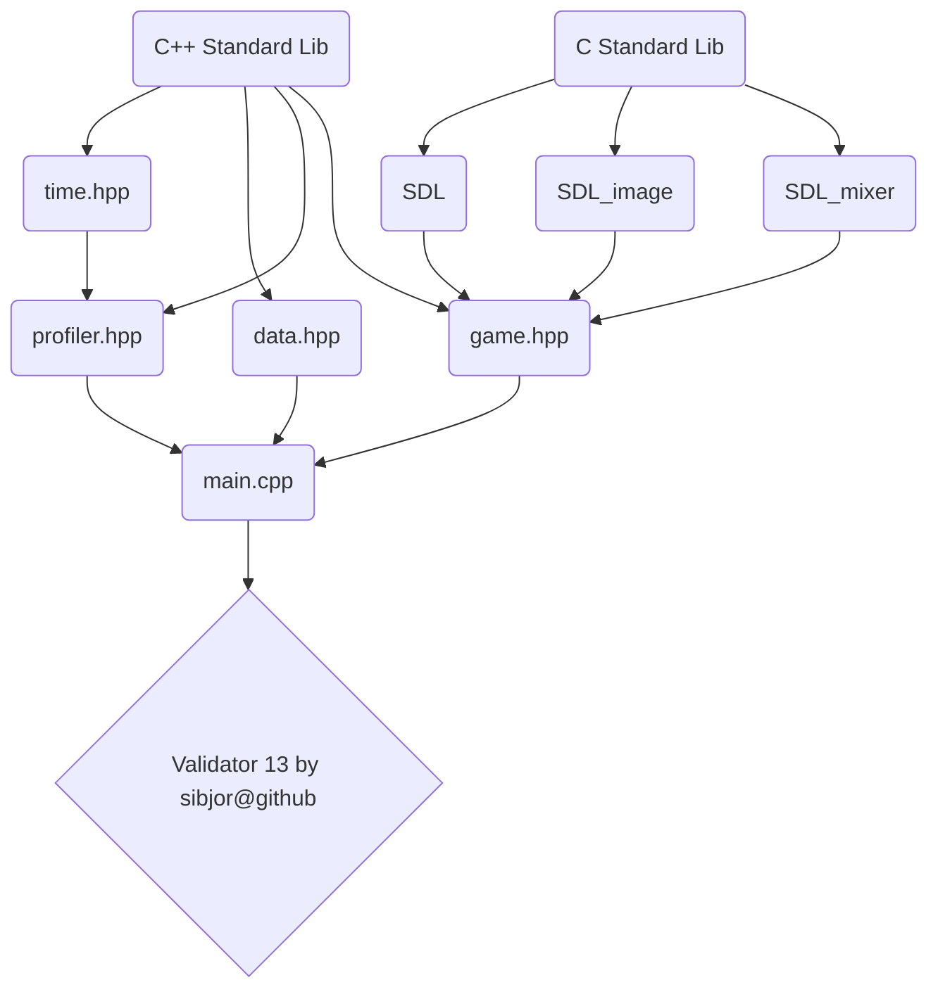

# Runner

## About

- Author: [sibjor](https://www.github.com/sibjor), Sixten Algot Björling
- Location: Forsbergs School, Kingdom of Sweden, Stockholm
- Issued by: Sebastian Jensen

## Project Dependencies


## Important 

- [Exporting with emscripten](https://wiki.libsdl.org/SDL3/README/emscripten)
- [SDL GPU API](https://wiki.libsdl.org/SDL3/CategoryGPU)
- [clock_t C++](https://en.cppreference.com/w/c/chrono/clock_t)
- [SDL_GetTicks](https://wiki.libsdl.org/SDL3/SDL_GetTicks)

## Good to know
- ***central.hpp*** is meant to finally be a pre-compiled header
- All planned usage of externally produced materials follows permitted terms stated in the relative license copy.

## IMPLEMENTATION

- Threads arent used so far, [read why](https://wiki.libsdl.org/SDL3/README/emscripten)

## Stuff I've learnt:

- GPU calculation symmetric dimensions of pixels, e.g. 100x100 not 100x92 by default
- Vector implementation
- SDL library (basic knowledge by now)
- 

```